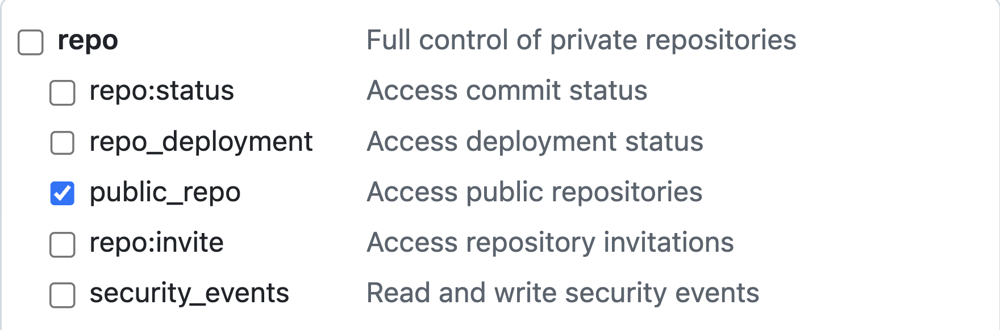

# 👮‍♀️ OrgWarden (Work In Progress)

*OrgWarden* helps ensure your GitHub organization's repositories follow best practices. Under the hood, OrgWarden uses [RepoAuditor](https://github.com/gt-sse-center/RepoAuditor).

## Installation

#### 1. Clone the Repository
```bash
git clone https://github.com/gt-tech-ai/OrgWarden.git

cd OrgWarden
```

#### 2. Sync Project with `uv`
```bash
uv sync
```

## Usage
You can run the tool with [`uv`](https://github.com/astral-sh/uv). The available commands are as follows:

### List Repositories
Lists all public, non-forked repositories for the specified GitHub organization.
```bash
uv run orgwarden list-repos <org_url>
```

### Audit
Runs [RepoAuditor](https://github.com/gt-sse-center/RepoAuditor) tooling. If the provided url points to a GitHub repository, RepoAuditor will run against said repository. If the provided url points to a GitHub organization, RepoAuditor will run against all public, non-forked repositories within said organization. The `gh-pat` option is a GitHub Personal Access Token (PAT) that RepoAuditor requires for full funcionality.

*Due to an issue with the GitHub API, OrgWarden currently only supports Classic PATs.*
```bash
uv run orgwarden audit <repo_or_org_url> --gh-pat [token]
```

## Using OrgWarden in GitHub Actions
OrgWarden runs daily via the [Auto-Audit](.github/workflows/Auto_Audit.yml) workflow. The run will fail if any of your organization's public, non-forked repositories fail an audit. Information on specific audit errors can be found in the failed workflow's [logs](../../../actions/workflows/Auto_Audit.yml). The workflow runs regardless of whether a GitHub Personal Access Token (PAT) has been setup, but will always fail if the token is not provided.

To setup a PAT for use in the workflow, please add your token as a [GitHub Actions Secret](../../../settings/secrets/actions) with the *Name* `AUTO_AUDIT_PAT`. Due to an issue with the GitHub API, your PAT must be a *Classic* token. *Fine-Grained* tokens are currently not supported. Your PAT must have the following minimum permissions:

#### For Auditing Public Repositories
- repo:public_repo ✅

<picture>
    
</picture>


```yaml
name: Auto Audit

on:
  schedule:
    - cron: '0 0 * * *' # daily at midnight UTC
  workflow_dispatch:

jobs:
  Auto-Audit:
    runs-on: ubuntu-latest
    steps:
      - name: Checkout OrgWarden
        uses: actions/checkout@v4
        with:
          repository: gt-tech-ai/OrgWarden

      - name: Setup uv
        uses: astral-sh/setup-uv@v5
        with:
          enable-cache: true

      - name: Install Dependencies
        run: uv sync --frozen

      # Audit the repository in which the workflow is triggered
      - name: Run Audit
        run: uv run orgwarden audit "$ORG_URL" --gh-pat "$AUTO_AUDIT_PAT"
        env:
          AUTO_AUDIT_PAT: ${{ secrets.AUTO_AUDIT_PAT }}
          ORG_URL: "${{ github.server_url }}/${{ github.repository_owner }}"
          GH_TOKEN: ${{ secrets.GITHUB_TOKEN }}
```

## Development
To manually run tests on this project, run the following command:
```bash
uv run pytest
```