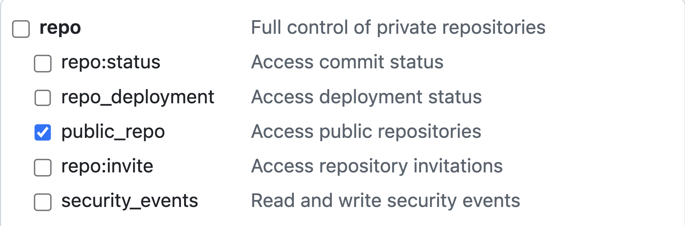
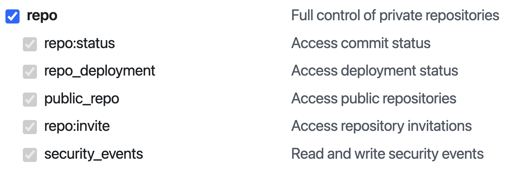

# OrgWarden 🔒

*OrgWarden* helps ensure your GitHub organization's repositories follow best practices. Under the hood, OrgWarden uses [RepoAuditor](https://github.com/gt-sse-center/RepoAuditor).

For help using OrgWarden in a GitHub Actions workflow, see [Using OrgWarden with GitHub Actions](#-using-orgwarden-with-github-actions).

## Installation

**1. Clone the Repository**
```bash
git clone https://github.com/gt-tech-ai/OrgWarden.git

cd OrgWarden
```

**2. Sync Project with `uv` - If `uv` is not installed, follow installation instructions [here](https://github.com/astral-sh/uv).**
```bash
uv sync
```


## Usage
You can run the tool with `uv`. The available commands are as follows:

### List Repositories
Lists all non-forked repositories for the specified GitHub organization pointed to by the `url` argument.

The `gh-pat` argument is a GitHub Personal Access Token (PAT) that is used to access your organization's repositories and avoid GitHub API rate limits. See [Setting Up a Personal Access Token](#setting-up-a-personal-access-token) for more information.

By default, the command only lists public repositories. If you'd like to include your organization's private repositories as well, use the `--include-private-repos` flag.

```bash
uv run orgwarden list-repos [org_url] [gh_pat]
```

### Audit
Runs [RepoAuditor](https://github.com/gt-sse-center/RepoAuditor) tooling. If the required `url` argument points to a GitHub repository, RepoAuditor will run against said repository. If the url points to a GitHub organization, RepoAuditor will run against all public, non-forked repositories within said organization.

The `gh-pat` argument is a GitHub Personal Access Token (PAT) that is used to access RepoAuditor's full functionality. See [Setting Up a Personal Access Token](#setting-up-a-personal-access-token) for more information.

The optional `settings_sequence` argument allows you to alter audit behavior on an individual repository basis by providing a sequence of settings strings. See [Repository-Specific Settings](#repository-specific-settings) for more information.

The optional `--module` flag allows you to specify which RepoAuditor modules you would like to include in the audit. All available modules will run if none are specified. See [RepoAuditor docs](https://github.com/gt-sse-center/RepoAuditor) for more information on available modules.

If you'd like to include private repositories in the audit, you can either use the `--include-all-private-repos` flag to audit all of your organizations private repositories, or use the `--include-private-repo` flag to include specific private repositories in the audit.

```bash
uv run orgwarden audit [repo_or_org_url] [gh_pat] [settings_sequence]... --module <module_1> --module <module_2> --include-private-repo <repo_name>
```


## Setting Up a Personal Access Token
A GitHub Personal Access Token (PAT) is required to make use of OrgWarden's full functionality. GitHub supports two types of Personal Access Tokens - Classic & Fine-grained. Fine-grained tokens provide greater control over permissions, and are recommended over Classic tokens. Either token type may be used with OrgWarden. For more information on Personal Access Tokens, see the [GitHub Docs](https://docs.github.com/en/authentication/keeping-your-account-and-data-secure/managing-your-personal-access-tokens).

### Creating a Fine-grained Personal Access Token
Your organization *must* be selected as the **Resource owner** for your fine-grained token.

<picture>
    
</picture>

<br />

Allow *Repository access* for all repositories.

<picture>
    
</picture>

<br />

Ensure your token has the following minimum permissions:

<table>
  <tr><th colspan="2">Repository Permissions</th></tr>
  <tr><th>Category</th><th>Access</th></tr>
  <tr><td>Administration</td><td>Read-only</td></tr>
  <tr><td>Contents</td><td>Read and write</td></tr>
  <tr><td>Metadata</td><td>Read-only</td></tr>
  <tr><td>Secret Scanning Alerts</td><td>Read-only</td></tr>
  <tr><td>Dependabot Alerts</td><td>Read-only</td></tr>

  <tr><th colspan="2">Organization Permissions</th></tr>
  <tr><td colspan="2">None</td></tr>
</table>

<picture>
    
</picture>

<br />

Your fine-grained token will need to be approved by one of your organization's admins.

### Creating a Classic Personal Access Token
If you will only be auditing public repositories, ensure your Classic PAT is created with the following minimum permissions:

repo - public_repo ✅

<picture>
    
</picture>

If you would like to audit both public *and* private repositories, ensure your Classic PAT is created with the following minimum permissions:

repo - all ✅

<picture>
    
</picture>


## Repository-Specific Settings
OrgWarden allows you to customize RepoAuditor's behavior by specifying CLI flags for each repository.

Settings can be passed to `orgwarden audit` in the form of a key-value settings string. Each *key* should be the name of a repository. Each *value* should contain the specific CLI flags you would like to pass to RepoAuditor. You may provide as many settings strings as you would like. This allows OrgWarden to run RepoAuditor audits with different requirements for each of your organization's repositories.

If you do not provide a settings string for one of your organization's repositories, that repository will be audited without any additional flags and will not be skipped.

**Format:** `"repository_name: cli_flags"`

For example, the following command...
```bash
orgwarden audit https://github.com/my-org gh_pat_mypat123 \
"my-awesome-next-app: --GitHub-AllowDeletions-true --GitHub-SupportWikis-false" \
"TopSecretInternalTool: --GitHub-AutoMerge-false"
```
...will run RepoAuditor against the `my-awesome-next-app` repository with the `--GitHub-AllowDeletions-true` and `--GitHub-SupportWikis-false` flags, against the `TopSecretInternalTool` repository with the `--GitHub-AutoMerge-false` flag, and with no additional flags for any of `my-org`'s other repositories.

**Note** - If invalid CLI flags are provided for a specific repository, RepoAuditor will fail that repository's audit and OrgWarden will continue auditing any remaining repositories.

For more information on available CLI flags, please visit the [RepoAuditor docs](https://github.com/gt-sse-center/RepoAuditor).


## ⚙ Using OrgWarden with GitHub Actions
OrgWarden can be used with GitHub Actions to ensure your organization's repositories comply with best practices.

We've created an easy to use [GitHub Action](/action.yml) that you can include in your workflows. The action will fail if any of your repositories fail an audit. Information on specific audit failures can be found in your workflow's logs.
You can use our action with the following inputs:

| Input | Required | Description |
| ----- | -------- | ----------- |
| org-url | yes | Full URL of the GitHub organization you would like to audit. |
| github-pat | yes | Your GitHub Personal Access Token (PAT). Store your token as a [GitHub Actions Secret](https://docs.github.com/en/actions/security-for-github-actions/security-guides/using-secrets-in-github-actions). |
| repository-audit-settings | no | Sequence of repository-specific audit settings. |
| modules | no | Specific RepoAuditor modules to run, separated by a space. |
| include-all-private-repos | no | Include all of your organization's private repositories in the audit. |
| included-private-repos | no | Specific private repositories to include in the audit. |

### Example: Using OrgWarden in a Workflow
```yaml
name: OrgWarden

on:
  schedule:
    - cron: '0 0 * * *' # daily at midnight UTC
  workflow_dispatch: # enables manual trigger

jobs:
  Run-OrgWarden:
    runs-on: ubuntu-latest
    steps:
      - uses: gt-tech-ai/OrgWarden@action-v0
        with:
          org-url: https://github.com/my-org
          github-pat: ${{ secrets.ORGWARDEN_AUDIT_PAT }}
          modules: GitHub GitHub-Customization
          repository-audit-settings: >
            "my-awesome-repo: --GitHub-AutoMerge-false --GitHub-License-value MIT"
            "secret-internal-tool: --GitHub-SupportProjects-false"
          included-private-repos: MyPrivateRepo secret-internal-tool
```


## Development
To manually run tests on this project, run the following command:
```bash
uv run pytest
```
OrgWarden uses [AutoGitSemVer](https://github.com/davidbrownell/AutoGitSemVer) to automatically update semantic version tags. If your changes introduce a *backwards-compatible* feature, please include "+minor" in your commit message's title or description. If your changes introduce a *backwards-incompatible* feature, please include "+major" in your commit message's title or description.