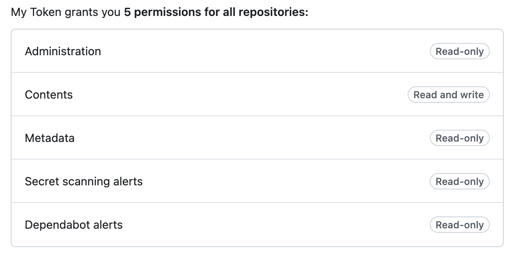

# 👮‍♀️ OrgWarden (Work In Progress)

*OrgWarden* helps ensure your GitHub organization's repositories follow best practices. Under the hood, OrgWarden uses [RepoAuditor](https://github.com/gt-sse-center/RepoAuditor).

## Installation

**1. Clone the Repository**
```bash
git clone https://github.com/gt-tech-ai/OrgWarden.git

cd OrgWarden
```

**2. Sync Project with `uv` - If `uv` is not installed, follow installation instructions [here](https://github.com/astral-sh/uv).**
```bash
uv sync
```


## Usage
You can run the tool with `uv`. The available commands are as follows:

### List Repositories
Lists all public, non-forked repositories for the specified GitHub organization.
```bash
uv run orgwarden list-repos [org_url]
```

### Audit
Runs [RepoAuditor](https://github.com/gt-sse-center/RepoAuditor) tooling. If the required `url` argument points to a GitHub repository, RepoAuditor will run against said repository. If the url points to a GitHub organization, RepoAuditor will run against all public, non-forked repositories within said organization.

The optional `settings` argument allows you to alter audit behavior on an individual repository basis by providing a sequence of settings strings. See [Repository-Specific Settings](#repository-specific-settings) for more information.

The `gh-pat` flag allows you to pass a GitHub Personal Access Token to RepoAuditor and is required for full funcionality. See [Setting Up a Personal Access Token](#setting-up-a-personal-access-token) for more information.

**Note** - If a PAT is not provided, `audit` will run with limited functionality **and will always exit with a non-zero exit code.**

```bash
uv run orgwarden audit [repo_or_org_url] [settings]... --gh-pat <token>
```


## Setting Up a Personal Access Token
A GitHub Personal Access Token (PAT) is required to make use of OrgWarden's full functionality. GitHub supports two types of Personal Access Tokens - Classic & Fine-grained. Fine-grained tokens provide greater control over permissions, and are recommended over Classic tokens. Either token type may be used with OrgWarden. For more information on Personal Access Tokens, see the [GitHub Docs](https://docs.github.com/en/authentication/keeping-your-account-and-data-secure/managing-your-personal-access-tokens).

### Creating a Fine-grained Personal Access Token
Your organization *must* be selected as the **Resource owner** for your fine-grained token.

<picture>
    
</picture>

<br />

Allow *Repository access* for all repositories.

<picture>
    
</picture>

<br />

Ensure your token has the following minimum permissions:

<table>
  <tr><th colspan="2">Repository Permissions</th></tr>
  <tr><th>Category</th><th>Access</th></tr>
  <tr><td>Administration</td><td>Read-only</td></tr>
  <tr><td>Contents</td><td>Read and write</td></tr>
  <tr><td>Metadata</td><td>Read-only</td></tr>

  <tr><th colspan="2">Organization Permissions</th></tr>
  <tr><td colspan="2">None</td></tr>
</table>

<picture>
    
</picture>

<br />

Your fine-grained token will need to be approved by one of your organization's admins.

### Creating a Classic Personal Access Token
Ensure your Classic PAT is created with the following minimum permissions:

repo - public_repo ✅

<picture>
    
</picture>


## Repository-Specific Settings
OrgWarden allows you to customize RepoAuditor's behavior by specifying CLI flags for each repository.

Settings can be passed to `orgwarden audit` in the form of a key-value settings string. Each *key* should be the name of a repository. Each *value* should contain the specific CLI flags you would like to pass to RepoAuditor. You may provide as many settings strings as you would like. This allows OrgWarden to run RepoAuditor audits with different requirements for each of your organization's repositories.

If you do not provide a settings string for one of your organization's repositories, that repository will be audited without any additional flags and will not be skipped.

**Format:** `"repository_name: cli_flags"`

For example, the following command...
```bash
orgwarden audit https://github.com/my-org \
"my-awesome-next-app: --GitHub-AllowDeletions-true --GitHub-SupportWikis-false" \
"TopSecretInternalTool: --GitHub-AutoMerge-false"
```
...will run RepoAuditor against the `my-awesome-next-app` repository with the `--GitHub-AllowDeletions-true` and `--GitHub-SupportWikis-false` flags, against the `TopSecretInternalTool` repository with the `--GitHub-AutoMerge-false` flag, and with no additional flags for any of `my-org`'s other repositories.

**Note** - If invalid CLI flags are provided for a specific repository, RepoAuditor will fail that repository's audit and OrgWarden will continue auditing any remaining repositories.

For more information on available CLI flags, please visit the [RepoAuditor docs](https://github.com/gt-sse-center/RepoAuditor).


## ⚙ Using OrgWarden with GitHub Actions
OrgWarden can easily be used with GitHub Actions to continually check your organization's public, non-forked repositories for compliance with best practices.

The provided example workflow runs OrgWarden on a daily basis. Note that the workflow run will fail if any of your organization's repositories fail an audit. Information on specific audit errors can be found in the failed workflow's logs.

To securely use a PAT in a workflow, you can add your token as a [GitHub Actions Secret](https://docs.github.com/en/actions/security-for-github-actions/security-guides/using-secrets-in-github-actions). In the example workflow, a token is stored as a secret named `AUTO_AUDIT_PAT`.

**Note** - As OrgWarden uses the GitHub CLI under-the-hood, the `GH_TOKEN` environment variable must be set for the step in which OrgWarden is used. See the [GitHub Docs](https://docs.github.com/en/actions/writing-workflows/choosing-what-your-workflow-does/using-github-cli-in-workflows) or the example workflow below for more information.

```yaml
name: Auto Audit

on:
  schedule:
    - cron: '0 0 * * *' # daily at midnight UTC
  workflow_dispatch: # enables manual trigger

jobs:
  Auto-Audit:
    runs-on: ubuntu-latest
    steps:
        # Setup OrgWarden ----------------
      - name: Checkout OrgWarden
        uses: actions/checkout@v4
        with:
          repository: gt-tech-ai/OrgWarden

      - name: Setup uv
        uses: astral-sh/setup-uv@v5

      - name: Install Dependencies
        run: uv sync --frozen
        # --------------------------------

        # Auditing an Organization with OrgWarden
      - name: Run OrgWarden Audit
        run: |
          uv run orgwarden audit "$ORG_URL" \
          "OrgWarden: --GitHub-AutoMerge-false --GitHub-License-value MIT" \
          "RepoAuditor: --GitHub-RebaseMergeCommit-true" \
          --gh-pat "$AUTO_AUDIT_PAT"
        env:
          # URL for the organization under which the workflow is triggered
          ORG_URL: "${{ github.server_url }}/${{ github.repository_owner }}"
          # Your PAT stored as a GitHub Secret
          AUTO_AUDIT_PAT: ${{ secrets.AUTO_AUDIT_PAT }}
          # Automatically generated by GitHub & required for use of GitHub CLI
          GH_TOKEN: ${{ secrets.GITHUB_TOKEN }}
```


## Development
To manually run tests on this project, run the following command:
```bash
uv run pytest
```